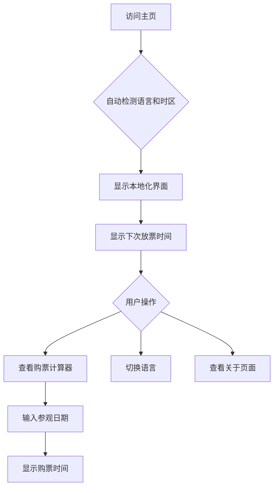

## 1. 产品概述
任天堂博物馆购票时间查询工具是一个静态网页应用，帮助用户计算和查询任天堂博物馆的门票发售时间。用户可以通过直观的界面了解何时可以购买特定月份的门票，以及计划参观时间对应的购票日期。

该工具解决了用户需要手动计算复杂购票时间规则的问题，为全球任天堂粉丝提供便捷的购票时间规划服务。

## 2. 核心功能

### 2.1 用户角色
本产品为单一用户角色，无需注册登录即可使用所有功能。

| 角色 | 访问方式 | 核心权限 |
|------|----------|----------|
| 访客用户 | 直接访问网页 | 使用所有查询和计算功能 |

### 2.2 功能模块
本产品包含以下主要页面：
1. **主页面**: 显示下次放票时间、购票计算器、语言切换、时区显示
2. **关于页面**: 使用说明、购票规则说明、技术说明

### 2.3 页面详情
| 页面名称 | 模块名称 | 功能描述 |
|-----------|-------------|-------------|
| 主页面 | 下次放票时间显示 | 自动计算并显示即将到来的放票日期和时间，显示对应的可购买月份 |
| 主页面 | 购票时间计算器 | 用户输入计划参观日期，自动计算对应的购票日期和时间 |
| 主页面 | 语言切换器 | 支持10-15种语言的切换，包括中文、英文、日文、韩文、西班牙文、法文、德文、意大利文、葡萄牙文、俄文等 |
| 主页面 | 时区自动识别 | 自动检测用户所在时区，将北京时间转换为当地时区显示 |
| 主页面 | 像素风格时钟 | 显示当前时间的像素风格时钟，增强任天堂主题氛围 |
| 关于页面 | 购票规则说明 | 详细说明任天堂博物馆的购票规则和时间逻辑 |
| 关于页面 | 使用指南 | 提供简单易懂的使用说明 |
| 关于页面 | 技术信息 | 显示开源信息、技术栈、贡献者信息等 |

## 3. 核心流程
用户访问网站后，系统会自动检测用户的语言和时区设置，显示本地化的界面。用户可以在主页面查看下次放票时间，或使用计算器输入计划参观日期来获取购票时间。

## 4. 用户界面设计

### 4.1 设计风格
- **主色调**: 任天堂红色 (#E60012)、纯白色 (#FFFFFF)、深灰色 (#2D2D2D)
- **按钮样式**: 像素风格方形按钮，带有轻微3D阴影效果
- **字体**: 像素风格字体，主要文字16px，标题24-32px
- **布局风格**: 卡片式布局，居中显示，最大宽度1200px
- **图标风格**: 像素风格图标，使用CSS绘制或开源像素图标库

### 4.2 页面设计概述
| 页面名称 | 模块名称 | UI元素 |
|-----------|-------------|-------------|
| 主页面 | 头部区域 | 像素风格的标题，使用任天堂经典红色，像素字体，标题下方显示像素化的博物馆图标（CSS绘制） |
| 主页面 | 下次放票时间 | 大卡片显示，像素边框，显示放票日期、时间、对应可购买月份，使用倒计时组件 |
| 主页面 | 购票计算器 | 输入框采用像素风格，日期选择器，计算按钮为像素风格，结果显示在像素对话框中 |
| 主页面 | 语言切换器 | 下拉菜单采用像素风格，显示国旗图标和语言名称 |
| 主页面 | 时区显示 | 小卡片显示当前时区，可手动切换时区 |
| 主页面 | 像素时钟 | 右上角显示像素风格数字时钟，实时更新 |
| 关于页面 | 内容区域 | 像素风格卡片布局，包含规则说明、使用指南、技术信息三个区块 |

### 4.3 响应式设计
采用桌面优先设计，完全适配移动端：
- 桌面端：多列布局，完整显示所有功能
- 平板端：双列布局，保持核心功能
- 手机端：单列布局，优化触摸交互，主要功能优先显示

### 4.4 国际化支持
支持语言列表：
1. 简体中文
2. 繁體中文
3. English
4. 日本語
5. 한국어
6. Español
7. Français
8. Deutsch
9. Italiano
10. Português
11. Русский
12. Nederlands
13. Svenska
14. العربية
15. ไทย

每种语言都包含完整的界面文本、日期格式、时间格式的本地化。