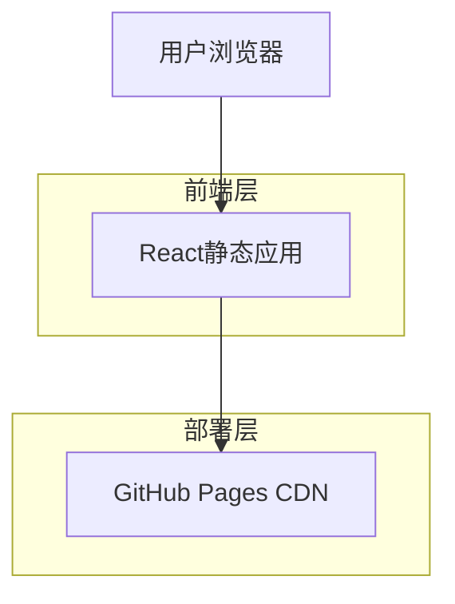

## 1. 架构设计



## 2. 技术描述

- **前端**: React@18 + TypeScript + TailwindCSS@3 + Vite
- **初始化工具**: vite-init
- **后端**: 无（纯静态应用）
- **部署**: GitHub Pages
- **核心依赖**: 
  - date-fns: 日期时间处理
  - react-i18next: 国际化支持
  - lucide-react: 图标库
  - canvas-confetti: 庆祝动画效果

## 3. 路由定义

| 路由 | 用途 |
|-------|---------|
| / | 主页，显示购票时间查询和计算器功能 |
| /about | 关于页面，包含使用说明和规则解释 |

## 4. 核心算法逻辑

### 4.1 计算第二个星期三
```typescript
// 获取指定月份的第二个星期三
function getSecondWednesday(year: number, month: number): Date {
  const firstDay = new Date(year, month - 1, 1);
  const firstWednesday = new Date(firstDay);
  
  // 找到第一个星期三
  const daysToWednesday = (3 - firstDay.getDay() + 7) % 7;
  firstWednesday.setDate(firstDay.getDate() + daysToWednesday);
  
  // 第二个星期三 = 第一个星期三 + 7天
  const secondWednesday = new Date(firstWednesday);
  secondWednesday.setDate(firstWednesday.getDate() + 7);
  
  return secondWednesday;
}
```

### 4.2 时区转换
```typescript
// 北京时间转用户本地时间
function beijingToLocalTime(beijingTime: Date, userTimezone: string): Date {
  const beijingOffset = 8; // UTC+8
  const userOffset = getTimezoneOffset(userTimezone);
  const timeDiff = (userOffset - beijingOffset) * 60 * 60 * 1000;
  
  return new Date(beijingTime.getTime() + timeDiff);
}
```

### 4.3 购票逻辑验证
```typescript
// 验证购票时间是否有效
function validateTicketPurchase(visitDate: Date): {
  canPurchase: boolean;
  purchaseDate: Date | null;
  message: string;
} {
  const now = new Date();
  const beijingTime = convertToBeijingTime(now);
  
  // 计算可购买月份（参观月份前2个月）
  const purchaseMonth = visitDate.getMonth() - 2;
  const purchaseYear = visitDate.getFullYear() + (purchaseMonth < 0 ? -1 : 0);
  const adjustedPurchaseMonth = purchaseMonth < 0 ? purchaseMonth + 12 : purchaseMonth;
  
  // 获取购票日期（第二个星期三）
  const purchaseDate = getSecondWednesday(purchaseYear, adjustedPurchaseMonth + 1);
  purchaseDate.setHours(13, 0, 0, 0); // 设置为13:00
  
  return {
    canPurchase: beijingTime >= purchaseDate,
    purchaseDate,
    message: beijingTime >= purchaseDate ? '可以购票' : '尚未到购票时间'
  };
}
```

## 5. 国际化配置

### 5.1 语言资源结构
```typescript
// 语言资源文件结构
interface TranslationResources {
  common: {
    title: string;
    description: string;
    language: string;
    timezone: string;
  };
  home: {
    nextTicketRelease: string;
    calculator: string;
    visitDate: string;
    calculate: string;
    result: string;
  };
  about: {
    title: string;
    rules: string;
    guide: string;
    tech: string;
  };
  date: {
    months: string[];
    weekdays: string[];
    format: string;
  };
}
```

### 5.2 日期格式化
```typescript
// 各语言的日期格式配置
const dateFormats = {
  'zh-CN': 'yyyy年MM月dd日 HH:mm',
  'zh-TW': 'yyyy年MM月dd日 HH:mm',
  'en': 'MMM dd, yyyy HH:mm',
  'ja': 'yyyy年MM月dd日 HH:mm',
  'ko': 'yyyy년 MM월 dd일 HH:mm',
  'es': 'dd \de MMM \de yyyy HH:mm',
  // ... 其他语言
};
```

## 6. 组件架构

### 6.1 主要组件结构
```typescript
// 页面组件
- App.tsx                 // 主应用组件
- pages/
  - Home.tsx              // 主页
  - About.tsx             // 关于页面
- components/
  - PixelClock.tsx        // 像素时钟组件
  - TicketCalculator.tsx  // 购票计算器
  - NextReleaseCard.tsx   // 下次放票时间卡片
  - LanguageSwitcher.tsx  // 语言切换器
  - TimezoneDisplay.tsx   // 时区显示组件
  - PixelButton.tsx       // 像素风格按钮
  - PixelCard.tsx         // 像素风格卡片
- hooks/
  - useTimezone.ts        // 时区检测和处理
  - useTicketLogic.ts     // 购票逻辑计算
  - usePixelTheme.ts      // 像素主题样式
- utils/
  - dateUtils.ts          // 日期工具函数
  - timezoneUtils.ts      // 时区转换工具
  - ticketLogic.ts        // 购票逻辑算法
```

### 6.2 像素风格实现
```typescript
// 像素风格CSS类
.pixel-border {
  border: 4px solid #2D2D2D;
  box-shadow: 
    0 4px 0 0 #2D2D2D,
    4px 0 0 0 #2D2D2D,
    0 -4px 0 0 #2D2D2D,
    -4px 0 0 0 #2D2D2D;
}

.pixel-button {
  background: #E60012;
  border: 4px solid #2D2D2D;
  box-shadow: 0 4px 0 0 #2D2D2D;
  transition: all 0.1s;
}

.pixel-button:active {
  transform: translateY(4px);
  box-shadow: 0 0 0 0 #2D2D2D;
}
```

## 7. 性能优化

### 7.1 构建优化
- 使用Vite的代码分割功能
- 按需加载语言资源
- 图片资源压缩和WebP格式
- CSS和JS文件压缩

### 7.2 运行时优化
- 使用React.memo优化重渲染
- 日期计算结果缓存
- 时区检测只执行一次
- 国际化资源懒加载

## 8. 部署配置

### 8.1 GitHub Pages配置
```yaml
# .github/workflows/deploy.yml
name: Deploy to GitHub Pages
on:
  push:
    branches: [ main ]
jobs:
  deploy:
    runs-on: ubuntu-latest
    steps:
      - uses: actions/checkout@v3
      - uses: actions/setup-node@v3
        with:
          node-version: 18
      - run: npm ci
      - run: npm run build
      - run: npm run deploy
```

### 8.2 Vite配置
```typescript
// vite.config.ts
export default defineConfig({
  base: '/nintendo-museum-ticket-calculator/',
  build: {
    outDir: 'dist',
    assetsDir: 'assets',
    sourcemap: true,
    rollupOptions: {
      output: {
        manualChunks: {
          'react-vendor': ['react', 'react-dom'],
          'i18n': ['react-i18next', 'i18next'],
          'date': ['date-fns'],
        }
      }
    }
  }
});
```